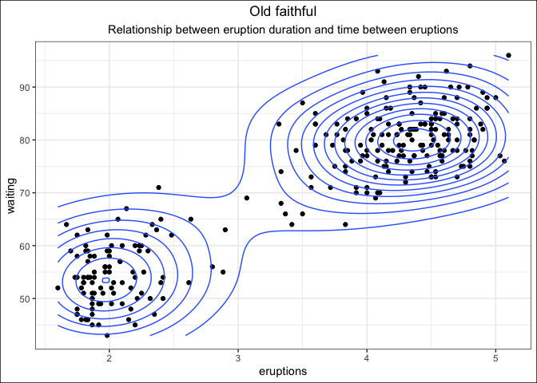

<!-- README.md is generated from README.Rmd. Please edit that file -->

# Why Tidyverse?

-   Function(s) or package for everything
-   Tools designed for efficient EDA
-   Functions describe their actions
-   Provide a consistent format for organisations to build on

### Tidyverse packages

These packages and functions are well maintained, open source, and under
continual improvement.

    -   dplyr: data manipulation

    -   stringr: string manipulation

    -   tidyr: data exploration tools

    -   purrr: functional iteration (loops)

    -   lubridate: date/time maniupulation

    -   readr: read different data types

### Exploratory Data Analysis

Exploratory Data Analysis (EDA) is a fundamental skill in data science.
Often one of the first tasks on any new project is understanding the
data you’re going to be working on. What data types are you working
with? What are the underlying distributions? How “clean” is the data?
Are there any inconsistencies you need to account for?

Tidyverse data transformation functions, paired with their easy
connection to ggplot functions, are very good for quickly understanding
large data sets.

``` r
datasets::faithful %>% 
  as_tibble() %>% 
  ggplot(aes(eruptions,waiting)) +
  geom_point() +
  geom_density2d() +
  theme_bw() +
  labs(title = "Old faithful",
       subtitle = "Relationship between eruption duration and time between eruptions") +
  theme(plot.title = element_text(hjust = 0.5),
    plot.subtitle = element_text(hjust = 0.5),
    plot.caption = element_text(hjust = 1),
    plot.background = element_rect(colour = "black"))
```

<!-- -->

### Quality Assurance

There are lots of different ways to solve problems, some ways offer more
transparent methods for checking whether the result was as intended. By
storing data in tables and retaining the original value, you can use
various methods to check the result.

For example, below I have attempted to extract the title and first name
of the passengers in the Titanic dataset. It appears as if the title is
preceded by a comma. We can apply the regex below to see if that result
works for the entire dataset, and come up with checks for ways it might
fail. For example I have use the length of the first name, sorted
smallest to largest, to check for very short names.

``` r
titanic::titanic_train %>% 
  select(Name) %>% 
  mutate(title = str_extract(Name,"(?<=\\, )\\w+"),
    first_name = str_extract(Name,"(?<=\\. )\\w+"),
         first_name_len = str_length(first_name)) %>% 
  arrange(first_name_len) %>% 
  head(3)
#>                                                       Name title first_name
#> 1 Rothes, the Countess. of (Lucy Noel Martha Dyer-Edwards)   the         of
#> 2                                            Bing, Mr. Lee    Mr        Lee
#> 3                              Sheerlinck, Mr. Jan Baptist    Mr        Jan
#>   first_name_len
#> 1              2
#> 2              3
#> 3              3
```

We can also check the unique results from the regex to see if any
odd/missing results are obtained. We can see below that one result has
returned “the” as a title. Looking up that individual result shows that
the regex has failed to account for a two word title. We can then update
the regex to look for results that are followed by a full stop.

``` r
titanic::titanic_train %>% 
  select(Name) %>% 
  mutate(title = str_extract(Name,"(?<=\\, )\\w+")) %>% 
  count(title) %>% 
  arrange(n) %>% 
  head(8)
#>      title n
#> 1     Capt 1
#> 2      Don 1
#> 3 Jonkheer 1
#> 4     Lady 1
#> 5      Mme 1
#> 6       Ms 1
#> 7      Sir 1
#> 8      the 1

titanic::titanic_train %>% 
  mutate(title = str_extract(Name,"(?<=\\, )\\w+")) %>% 
  filter(title == "the")
#>   PassengerId Survived Pclass
#> 1         760        1      1
#>                                                       Name    Sex Age SibSp
#> 1 Rothes, the Countess. of (Lucy Noel Martha Dyer-Edwards) female  33     0
#>   Parch Ticket Fare Cabin Embarked title
#> 1     0 110152 86.5   B77        S   the
```

### Tidyverse code doubles as pseudo-comments

From the [dplyr site](https://dplyr.tidyverse.org) - *“dplyr is a
grammar of data manipulation, providing a consistent set of verbs that
help you solve the most common data manipulation challenges.”*

Functions describe the action being taken - filter, select, summarise,
arrange - these functions allow readers to know what action is being
taken in each step without additional comments.

Additionally, pipes allow for chaining together logical, step-wise and
reversible data pipelines. For example the code below converts row names
to a column variable, extracts the car brand from the model name, lumps
infrequent brands together, overwrites the mpg variable to a log scale,
and provides mean mpg and record counts for each brand, arranged by
count.

    ```r
    mtcars %>% 
      rownames_to_column(var = "model") %>% 
      mutate(brand = str_extract(model,"\\w+"),
             brand = fct_lump(brand,5),
             mpg = log(mpg)) %>% 
      group_by(brand) %>% 
      summarise(ave_mpg = mean(mpg),
                n = n()) %>% 
      arrange(-n)
    #> # A tibble: 6 × 3
    #>   brand  ave_mpg     n
    #>   <fct>    <dbl> <int>
    #> 1 Other     2.86    17
    #> 2 Merc      2.93     7
    #> 3 Fiat      3.39     2
    #> 4 Hornet    3.00     2
    #> 5 Mazda     3.04     2
    #> 6 Toyota    3.30     2
    ```

The chain of transforms applied to each step is logical, following a
mental model of stepping through a process. These actions never alter
(unless specified) the underlying data-set, meaning that any changes are
temporary and reversible, allowing for a trial and error process in
applying each transform.

### Leveraging off each others’ work

In most cases, EDA and data manipulation follows a similar format,
irrespective of the language or library being used. These languages and
libraries all do similar or the same operations with various syntax.
Read-in data, tidy, transform, subset, join with other data sources,
summarise, export. If you believe the reasoning above, the Tidyverse
offers a very compelling case for being the primary method for doing
this work.

The benefit of everyone follows a similar format, ie. Tidyverse
functions over base R or data.table, are:

-   picking up people’s work is faster and easier to understand
-   colleagues can adapt others’ work, building on their ideas
